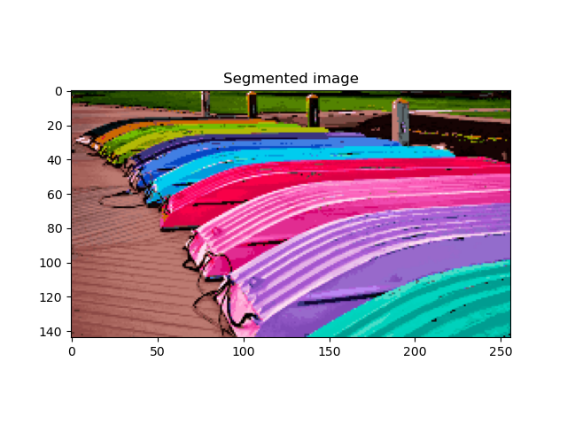
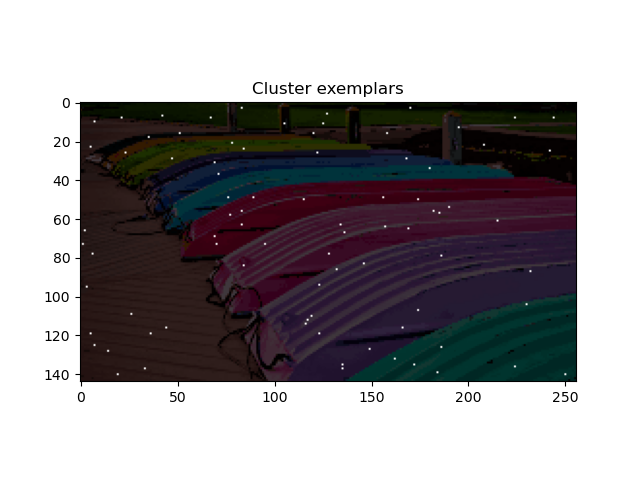
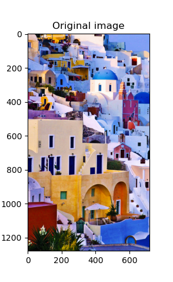
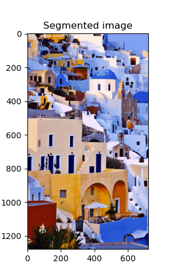

# Graph WatershEd using Nearest Neighbors (GWENN)

## Unsupervised density-based image segmentation 

GWENN is an unsupervised clustering method based on a kNN graph to propagate labels from high to low density regions of the feature space.

A multiresolution setting (Haar DWT) is also proposed to segment large-size images.

# Codes

`script_GWENN_images.py` applies the baseline GWENN method. The only parameter of the method is `K`, the number of nearest neighbors.
Notice that the number of segments/clusters need not be given, but is automatically provided at output.

`MR_gwenn.py` is the multiresolution setup of GWENN. Again, `K` must be given, as well as the number of levels `nLevel` of the DWT.

For both approaches, the set of final exemplar pixels (cluster representatives) are shown. 

# Examples

## Using `script_GWENN_images.py`
`flatboad_small.png`, 256x144 pixels, `K = 100`, 82 output clusters.

 
 
 

## Using `MR_gwenn.py`
`colorful_houses_small.png`, 720x1280 pixels, `K = 5`, `nLevel = 4`, 1066 output clusters.

  

# Requirements

- Python 3.7.7
- Scikit-learn 0.23.2
- Numpy 1.19.2

# References

C. Cariou and K. Chehdi, “A new k-nearest neighbor density-based clustering method and its application to hyperspectral images,” in *Proc. IEEE International Geoscience and Remote Sensing Symposium (IGARSS)*, Beijing, China, 2016, pp. 6161–6164, https://doi.org/10.1109/IGARSS.2016.7730609 .

C.  Cariou  and  K.  Chehdi,  “Nearest neighbor-density-based clustering methods for large hyperspectral images,” in *Proc. SPIE Image and Signal Processing for Remote Sensing XXIII*, vol. 10427, Warzaw, Poland, 2017, https://doi.org/10.1117/12.2278221 .

Cariou, C.; Le Moan, S.; Chehdi, K. Improving K-Nearest Neighbor Approaches for Density-Based Pixel Clustering in Hyperspectral Remote Sensing Images. *Remote Sensing*, 2020, 12, 3745. https://doi.org/10.3390/rs12223745 .

